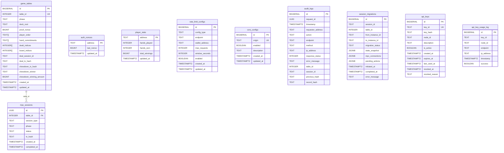

# 🗄️ Coordinator Database Schema & ER Diagram

> **Auto-generated reference.** Updates automatically when database migrations are modified.

## Entity-Relationship Diagram

## Tables Detail

### `game_tables`

| Column | Type | Constraints | Reference |
| --- | --- | --- | --- |
| `id` | `BIGSERIAL` | PRIMARY KEY | - |
| `table_id` | `INTEGER` | NOT NULL, UNIQUE | - |
| `phase` | `TEXT` | NOT NULL | - |
| `deck_root` | `TEXT` | Nullable | - |
| `proof_nonce` | `BIGINT` | NOT NULL | - |
| `player_order` | `TEXT[]` | NOT NULL | - |
| `hand_commitments` | `TEXT[]` | NOT NULL | - |
| `dealt_indices` | `INTEGER[]` | NOT NULL | - |
| `board_indices` | `INTEGER[]` | NOT NULL | - |
| `deal_session_id` | `TEXT` | Nullable | - |
| `deal_tx_hash` | `TEXT` | Nullable | - |
| `showdown_tx_hash` | `TEXT` | Nullable | - |
| `showdown_winner` | `TEXT` | Nullable | - |
| `showdown_winning_amount` | `BIGINT` | Nullable | - |
| `created_at` | `TIMESTAMPTZ` | NOT NULL | - |
| `updated_at` | `TIMESTAMPTZ` | NOT NULL | - |

### `mpc_sessions`

| Column | Type | Constraints | Reference |
| --- | --- | --- | --- |
| `id` | `UUID` | PRIMARY KEY | - |
| `table_id` | `INTEGER` | NOT NULL | `game_tables.$table_id` |
| `session_type` | `TEXT` | NOT NULL | - |
| `phase` | `TEXT` | Nullable | - |
| `status` | `TEXT` | NOT NULL | - |
| `tx_hash` | `TEXT` | Nullable | - |
| `created_at` | `TIMESTAMPTZ` | NOT NULL | - |
| `completed_at` | `TIMESTAMPTZ` | Nullable | - |

### `auth_nonces`

| Column | Type | Constraints | Reference |
| --- | --- | --- | --- |
| `address` | `TEXT` | PRIMARY KEY | - |
| `last_nonce` | `BIGINT` | NOT NULL | - |
| `updated_at` | `TIMESTAMPTZ` | NOT NULL | - |

### `player_stats`

| Column | Type | Constraints | Reference |
| --- | --- | --- | --- |
| `address` | `TEXT` | PRIMARY KEY | - |
| `hands_played` | `INTEGER` | NOT NULL | - |
| `hands_won` | `INTEGER` | NOT NULL | - |
| `total_winnings` | `BIGINT` | NOT NULL | - |
| `updated_at` | `TIMESTAMPTZ` | NOT NULL | - |

### `rate_limit_configs`

| Column | Type | Constraints | Reference |
| --- | --- | --- | --- |
| `id` | `BIGSERIAL` | PRIMARY KEY | - |
| `config_type` | `TEXT` | NOT NULL | - |
| `endpoint` | `TEXT` | Nullable | - |
| `wallet_address` | `TEXT` | Nullable | - |
| `max_requests` | `INTEGER` | NOT NULL | - |
| `window_seconds` | `INTEGER` | NOT NULL | - |
| `enabled` | `BOOLEAN` | NOT NULL | - |
| `created_at` | `TIMESTAMPTZ` | NOT NULL | - |
| `updated_at` | `TIMESTAMPTZ` | NOT NULL | - |

### `cors_configs`

| Column | Type | Constraints | Reference |
| --- | --- | --- | --- |
| `id` | `BIGSERIAL` | PRIMARY KEY | - |
| `origin` | `TEXT` | NOT NULL, UNIQUE | - |
| `enabled` | `BOOLEAN` | NOT NULL | - |
| `description` | `TEXT` | Nullable | - |
| `created_at` | `TIMESTAMPTZ` | NOT NULL | - |
| `updated_at` | `TIMESTAMPTZ` | NOT NULL | - |

### `audit_logs`

| Column | Type | Constraints | Reference |
| --- | --- | --- | --- |
| `id` | `BIGSERIAL` | PRIMARY KEY | - |
| `request_id` | `UUID` | NOT NULL | - |
| `timestamp` | `TIMESTAMPTZ` | NOT NULL | - |
| `requester_address` | `TEXT` | Nullable | - |
| `action` | `TEXT` | NOT NULL | - |
| `endpoint` | `TEXT` | NOT NULL | - |
| `method` | `TEXT` | NOT NULL | - |
| `ip_address` | `TEXT` | Nullable | - |
| `response_status` | `INTEGER` | Nullable | - |
| `error_message` | `TEXT` | Nullable | - |
| `table_id` | `INTEGER` | Nullable | - |
| `session_id` | `TEXT` | Nullable | - |
| `previous_hash` | `TEXT` | Nullable | - |
| `record_hash` | `TEXT` | NOT NULL | - |

### `session_migrations`

| Column | Type | Constraints | Reference |
| --- | --- | --- | --- |
| `id` | `BIGSERIAL` | PRIMARY KEY | - |
| `session_id` | `TEXT` | NOT NULL | - |
| `table_id` | `INTEGER` | NOT NULL | - |
| `from_instance_id` | `TEXT` | NOT NULL | - |
| `to_instance_id` | `TEXT` | NOT NULL | - |
| `migration_status` | `TEXT` | NOT NULL | - |
| `state_snapshot` | `JSONB` | Nullable | - |
| `mpc_connections` | `JSONB` | Nullable | - |
| `pending_actions` | `JSONB` | Nullable | - |
| `initiated_at` | `TIMESTAMPTZ` | NOT NULL | - |
| `completed_at` | `TIMESTAMPTZ` | Nullable | - |
| `error_message` | `TEXT` | Nullable | - |

### `api_keys`

| Column | Type | Constraints | Reference |
| --- | --- | --- | --- |
| `id` | `BIGSERIAL` | PRIMARY KEY | - |
| `key_id` | `TEXT` | NOT NULL, UNIQUE | - |
| `key_hash` | `TEXT` | NOT NULL | - |
| `node_id` | `TEXT` | NOT NULL | - |
| `description` | `TEXT` | Nullable | - |
| `is_active` | `BOOLEAN` | NOT NULL | - |
| `created_at` | `TIMESTAMPTZ` | NOT NULL | - |
| `expires_at` | `TIMESTAMPTZ` | Nullable | - |
| `last_used_at` | `TIMESTAMPTZ` | Nullable | - |
| `revoked_at` | `TIMESTAMPTZ` | Nullable | - |
| `revoked_reason` | `TEXT` | Nullable | - |

### `api_key_usage_log`

| Column | Type | Constraints | Reference |
| --- | --- | --- | --- |
| `id` | `BIGSERIAL` | PRIMARY KEY | - |
| `key_id` | `TEXT` | NOT NULL | - |
| `node_id` | `TEXT` | NOT NULL | - |
| `endpoint` | `TEXT` | NOT NULL | - |
| `ip_address` | `TEXT` | Nullable | - |
| `timestamp` | `TIMESTAMPTZ` | NOT NULL | - |
| `success` | `BOOLEAN` | NOT NULL | - |
