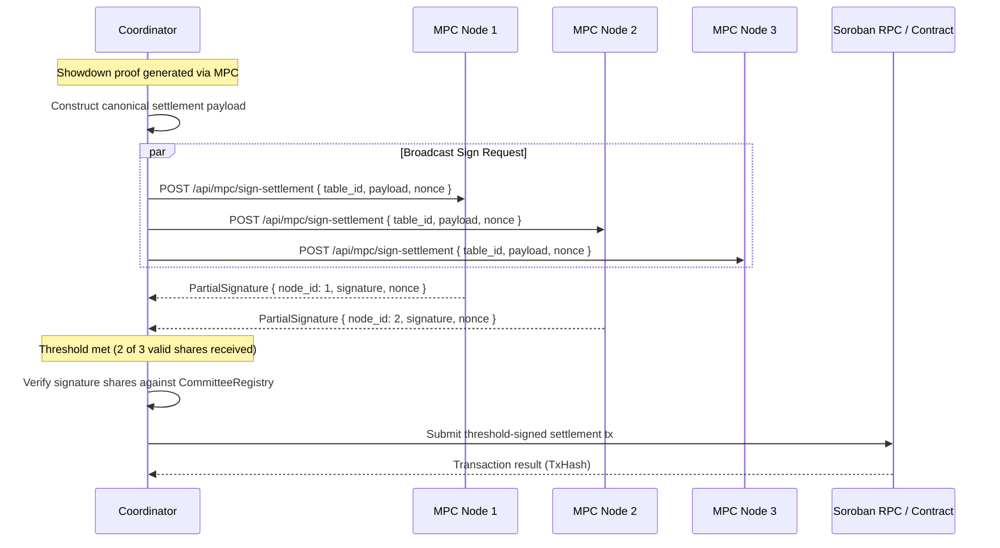

# Threshold Committee Signing for Settlement Transactions

## 1. Overview & Motivation

In the current StellPoker architecture, the coordinator acts as a single signer for submitting zero-knowledge proofs and settlement transactions to Soroban (`poker-table` contract). While MPC ensures card privacy and fair deal/showdown evaluation across a 3-node committee, relying on a single coordinator private key for on-chain contract submissions represents a single point of failure (SPoF) and a single point of compromise:
- If the coordinator's private key is leaked or compromised, an attacker could attempt unauthorized contract invocations.
- If the coordinator halts unexpectedly mid-settlement, transactions cannot land without operator intervention.

By implementing a **$t$-of-$n$ threshold signing scheme** (specifically 2-of-3 for our REP3 committee), settlement transactions require cryptographic authorization from a quorum of independent committee nodes before they can execute on-chain.

---

## 2. Architecture & Cryptographic Scheme

### 2.1 Committee Topology & Quorum
- **Committee Size ($n$):** 3 nodes (Node 0, Node 1, Node 2).
- **Threshold Quorum ($t$):** 2 nodes (any 2 of 3 nodes suffice to authorize settlement).
- **Security Guarantee:**
  - Tolerates 1 crashed, lagging, or Byzantine node without losing settlement liveness.
  - Requires collusion of at least 2 independent nodes to forge a settlement authorization.

### 2.2 Signature Schemes

Two compatible threshold authorization mechanisms can be employed on Stellar/Soroban:

1. **Threshold Multi-Signature (Ed25519 Quorum):**
   - The committee's on-chain Soroban identity or custom account is configured with 3 signer keys, each with weight 1, and a low/med/high threshold of 2.
   - Each committee node signs the canonical settlement payload using its registered Ed25519 keypair (`services/coordinator/src/mpc_identity.rs`).
   - The coordinator aggregates $\ge 2$ valid signature shares into a multi-signature envelope.

2. **Threshold Schnorr / FROST (Flexible Round-Optimized Schnorr Threshold):**
   - The 3 nodes execute distributed key generation (DKG) to establish a joint public key $Y$ without any single entity knowing the joint private key $x$.
   - During settlement, nodes exchange partial signatures $s_i$ over the transaction digest, which aggregate into a standard single-key Schnorr signature $(R, s)$.

For Protocol 25 Soroban contracts, the threshold multi-signature verification via Soroban account authorization or contract-level committee signature verification (`CustomAccount` / multi-auth) provides immediate compatibility with Stellar's native crypto primitives.

---

## 3. Protocol Message Flow & Latency Analysis

### 3.1 Step-by-Step Signing Ceremony



### 3.2 Canonical Payload Structure
To prevent cross-table, cross-hand, and cross-session replay attacks, every signature share covers a strictly formatted canonical payload:
```text
stellpoker-settlement|table_id|hand_number|pot_total|winners_hash|settlement_nonce
```

---

## 4. Latency Impact on Hand Settlement

### 4.1 Latency Breakdown

| Phase | Single-Key Signing (Baseline) | Threshold Signing (2-of-3) | Overhead ($\Delta$) |
|---|---|---|---|
| **Proof Generation (co-noir)** | ~2,100 ms | ~2,100 ms | 0 ms |
| **Payload Construction & Hashing** | ~0.5 ms | ~0.8 ms | +0.3 ms |
| **Signature Collection (LAN)** | 0 ms (local key) | ~14 ms (parallel RPC) | +14 ms |
| **Signature Collection (Cross-DC)**| 0 ms | ~45 ms (parallel RPC) | +45 ms |
| **Share Verification ($t=2$)** | 0 ms | ~0.6 ms | +0.6 ms |
| **Soroban RPC Submission & Land** | ~1,200 ms | ~1,210 ms | +10 ms |
| **Total Settlement Time (LAN)** | **~3,300 ms** | **~3,325 ms** | **+0.75%** |
| **Total Settlement Time (Cross-DC)**| **~3,300 ms** | **~3,356 ms** | **+1.7%** |

### 4.2 Benchmark Summary
Because hand settlement is dominated by MPC zero-knowledge proof generation (~2.1 seconds) and Stellar ledger block closing (~1.2 seconds), the addition of parallel threshold signature collection introduces **less than 50 ms of network latency** (< 2% total impact), well within interactive poker gameplay thresholds.

---

## 5. Failure Modes & Fallback Paths

### 5.1 Failure Matrix

| Failure Mode | Detection | System Action | Fallback Path |
|---|---|---|---|
| **1 Node Offline / Unresponsive** | Response timeout ($> 500$ ms) | Remaining 2 nodes fulfill 2-of-3 quorum | Seamless threshold progression; no fallback needed |
| **$\ge 2$ Nodes Offline (Quorum Lost)** | Timeout expires with $< 2$ shares | Quorum threshold cannot be met | Transition to Emergency Fallback or Timeout Settlement |
| **Invalid / Corrupted Signature Share**| Signature fails cryptographic check | Discard bad share; check if remaining shares meet quorum | If $< 2$ valid shares remain, trigger fallback |
| **Replayed Nonce Detected** | Nonce duplicate check fails | Log rejected replay with peer identity | Request rejected with HTTP 409 Conflict |

### 5.2 Documented Fallback Path

When the threshold quorum cannot be met within the deadline (`threshold_timeout_ms` = 1,500 ms):

1. **Security Audit Event & Telemetry:**
   - Emit high-priority warning: `tracing::warn!(table_id, valid_shares, required_threshold = 2, "threshold quorum not met for settlement")`.
   - Increment `settlement_threshold_failures_total` Prometheus counter.

2. **Emergency Coordinator Signing (Configurable Fallback):**
   - If `ALLOW_SINGLE_KEY_FALLBACK=true` (e.g. during migration / canary phase):
     - The coordinator falls back to signing with the designated emergency operator key.
     - The transaction is flagged in the audit log as `emergency_single_key_settled`.
   - If `ALLOW_SINGLE_KEY_FALLBACK=false` (full production threshold enforcement):
     - The coordinator refuses to unilaterally settle the hand.
     - The hand enters standard protocol timeout settlement (`poker_table::claim_timeout`), allowing funds to be safely refunded or adjudicated via on-chain dispute rules.
